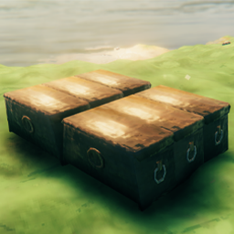

# ChestSnap

A mod for Valheim that adds snap points to chests and crates, allowing you to place them perfectly on a grid or stack them with ease.

## About

ChestSnap solves the problem of imprecise chest placement. It automatically injects snap points into the prefabs of various containers. No more spending minutes trying to align your storage — now they snap like building pieces.

### Supported Buildings
* **Vanilla:** All vanilla chests and containers.
* **BuildIt (OdinPlus):** All crates.
* **Construction (MrSerji):** Branch chest.
* **Valharvest (Frenvius):** Apple, Garlic, Pepper, Potato, Salt, and Tomato boxes.
* **Valharvest:** Cultivated Ground (various sizes).

## How It Works

The mod load data a YAML configuration file and injects snap points into placeable objects.

* **Dynamic Injection:** Snap points are added to the prefabs, so all existing and new chests will have them.
* **YAML-based:** Coordinates are stored in an external file, making it easy to add support for new mods without recompiling.
* **Visual Debugging:** Includes a built-in overlay system to visualize object bounds and snap points in real-time.

## Console Commands

The mod adds a terminal command to help you find snap points for new objects:

| Command | Arguments | Description |
|---------|-----------|-------------|
| `generate_snap_points` | `[onlyBottom:bool]` | Generates snap points for the building piece you are currently hovering with a hammer. Saves points to the YAML config. |

## Configuration

Modify `com.Frogger.ChestSnap.cfg` in your `BepInEx/config` to toggle debug visuals:
* `Show debug visuals`: Hidden / Always / OnHover.
* `Draw object bounds`: Toggles green bounding box.
* `Draw snap points`: Toggles cyan snap point spheres.

### Custom Snap Points
You can manually edit `BepInEx/config/com.Frogger.ChestSnap__snappoints_data.yaml` to add support for any modded container.

**Format example:**
```yaml
piece_chest_wood:
  - (0.8, 0, 0.37)
  - (0.8, 0, -0.37)
```

## Install Notes

This is a fully **client-side** mod. It should be installed on the client.
There is no need to install on a dedicated server.

### Credits

 Discord — `justafrogger`<br>
 <a href="https://thunderstore.io/c/valheim/p/Frogger/ChestSnap/">Mod page</a><br>

<ins>If something does not work for you, you have found any bugs, or have suggestions — write to me!</ins>
